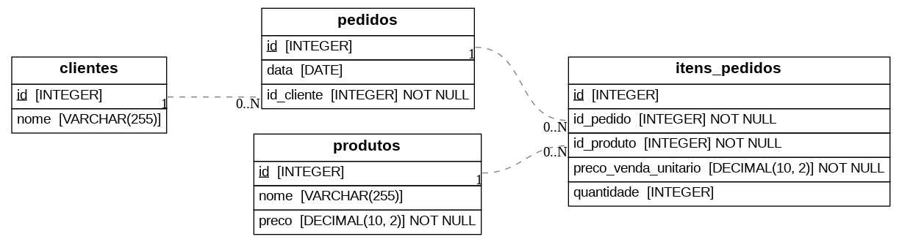

# SQL  + Python 🛢️🐍
Esse repositório é, além de uma análise exploratória de uma database, uma demonstração de diversas funcionalidades da biblioteca [SQL Alchemy](https://www.sqlalchemy.org) e de instruções SQL.


O contexto é numa loja fictícia de instrumentos e artigos para música. Algumas perguntas elaboradas pelo autor (*c'est moi!*) são respondidas para trazer informações possivelmente úteis à diretoria do estabelecimento comercial.
O **S**istema de **G**erenciamento de **B**anco de **D**ados (SGBD) utilizado foi o [SQLite](https://sqlite.org), escolhido por sua simplicidade e praticidade adequadas aos propósitos deste repositório.

## Diagrama entidade-relacionamento



## 📦 Estrutura (somente partes principais)
```
symphony-sql/
│
├── sql/
│   ├── schema.sql        # arcabouço básico (tabelas)
│   ├── seed.sql          # povoamento (inserts)
│   ├── joins/            # pasta com snippets para os joins
│   └── new.sql           # dados das novas vendas
│   
├── src/
|   └── app.ipynb
│
├── data/
│   └── sample.db         # pode ser gerado a partir do schema.sql e seed.sql
|
├── requirements.txt
│
└── README.md
```

## 🎶 Como ouvir a orquestra
**Pré-requisitos**: Python 3.8 ou superior.

1. Clone o repositório
```bash
git clone https://github.com/ryannfoliveira/symphony-sql
```
2. Navegue até o diretório
```bash
cd symphony-sql
```
3. Instale os módulos necessários, preferencialmente dentro de um ambiente virtual.
```bash
pip install -r requirements.txt
```
4. Execute o notebook
```bash
jupyter notebook src/app.ipynb
```

## Notas

Os dados utilizados neste repositório são fictícios e foram produzidos por script próprio, não sendo utilizado nenhum dataset de terceiros. Eles se referem a uma filial de uma loja de música que foi aberta em uma cidade de médio porte, e às vendas digitais para aquela localidade.
